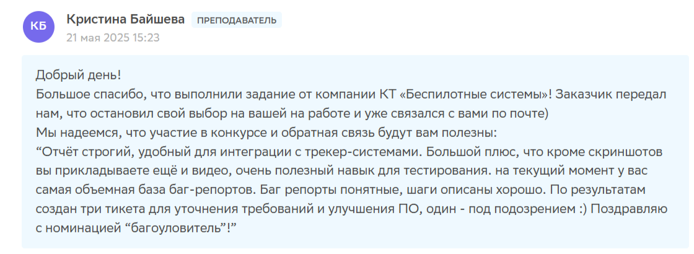

### **Портфолио / Junior QA Engineer / Гурская Алена**

#### **Обо мне**

*   **ФИО:** Гурская Алена Александровна
*   **Должность:** Junior QA Engineer (Тестировщик)
*   Владею навыками составления тестовой документации (чек-листы, тест-кейсы), баг-репортинга в Jira, работы с API 
через Postman и написания базовых SQL-запросов. Ищу возможность присоединиться к команде, где смогу применять 
и развивать свои навыки.
    В последние годы я работала по другой специальности. В данной специальности опыта нет.
---

#### **Навыки и технологии (Skills)**

*   **Направления тестирования:** Функциональное, Регрессионное, UI-тестирование, Тестирование API.
*   **Инструменты тестирования:**
    *   **Багрепорты:** Jira, Trello, GitHub Issues;
    *   **API:** Postman (написание простых запросов);
    *   **Базы данных:** SQL (SELECT, JOIN, WHERE);
    *   **Браузерные инструменты:** DevTools (Console, Network, Elements);
    *   **Версионный контроль:** Git.
* **Технические знания:** HTTP/HTTPS, клиент-серверная архитектура, основы HTML/CSS.

---

#### **Проекты**
**Проект №1: Тестирование мобильного приложения Nextracker**
* **Описание проекта:** Nextracker — приложение для закрепления полезных привычек.
* **Цели тестирования:** Провести функциональное и UI-тестирование ключевого сценария работы с привычкой (создание, 
* отслеживание, сброс прогресса).
* **Вид тестирования:** Функциональное, UI.
* **Процесс тестирования:**
  Протестированы сценарии: создание привычки, отметка о выполнении, редактирование, удаление, проверка ежедневного 
  сброса прогресса.
  * [Чек-лист](https://docs.google.com/spreadsheets/d/111C4G4dtVFmMLLval47zEJq7lY1KxSsBz-LX518Um5A/edit?gid=0#gid=0)
  * [Тест-кейсы](https://docs.google.com/spreadsheets/d/111C4G4dtVFmMLLval47zEJq7lY1KxSsBz-LX518Um5A/edit?gid=134044071#gid=134044071)
  * [Баг-репорты](https://docs.google.com/spreadsheets/d/111C4G4dtVFmMLLval47zEJq7lY1KxSsBz-LX518Um5A/edit?gid=830725016#gid=830725016)  
* **Результаты:**
Всего проведено 30 тестов, из них 25 прошли успешно, 5 провалились. Найден критический баг, связанный с некорректным 
сбросом прогресса привычки, который нарушал основную логику приложения. 

**Проект №2: Тестирование учебного приложение для операций с банковскими счетами / Командный проект**
* **Описание проекта:** В заготовке проекта есть классы для двух видов банковских счетов: сберегательного и кредитного.
Оба счёта имеют три основные операции: пополнение, покупку и прогноз процентов за год.
* **Цели тестирования:** Провести модульное (Unit) и функциональное тестирование методов классов CreditAccount 
и SavingAccount (пополнение, списание, расчет процентов).
* **Вид тестирования:** Unit-тестирование, функциональное.
* **Процесс тестирования:**
    1. Написала 58 unit-тестов на JUnit для проверки корректности работы методов класса CreditAccount в различных 
  граничных условиях (попытка списания суммы больше баланса, начисление процентов и т.д.).
       * [Реализованные тесты для класса CreditAccount](https://github.com/AlenaGurskaya/javaqa-team-diplom-2/blob/main/src/test/java/ru/netology/javaqadiplom/CreditAccountTest.java)
       * [Заведенные баг-репорты для класса CreditAccount](https://github.com/AlenaGurskaya/javaqa-team-diplom-2/issues?q=is%3Aissue%20state%3Aclosed%20author%3AAlenaGurskaya)
    2. Проанализировала и исправила логику в классе SavingAccount на основе 10 баг-репортов, составленных напарником.
       * [Исправленный класс SavingAccount](https://github.com/AlenaGurskaya/javaqa-team-diplom-2/blob/main/src/main/java/ru/netology/javaqadiplom/SavingAccount.java)
* **Результаты:**
  * В результате тестирования выявлено 20 дефектов в логике работы кредитного счета. Все баги задокументированы.
  * Успешно исправлены все переданные баги, что подтверждено прохождением соответствующих тестов.
  * [Репозиторий Командного проекта](https://github.com/AlenaGurskaya/javaqa-team-diplom-2)

**Проект №3: Автоматизация тестирования комплексного сервиса, взаимодействующего с СУБД**
* **Описание проекта:** Приложение — это веб-сервис, который предлагает купить тур по определённой цене двумя способами:
  1. Обычная оплата по дебетовой карте.
  2. Уникальная технология: выдача кредита по данным банковской карты.
* **Цели тестирования:** Провести комплексное тестирование веб-сервиса (ручное и автоматизированное), включая работу 
с двумя формами оплаты и взаимодействие с СУБД.
* **Вид тестирования:** Функциональное, UI.
* **Процесс тестирования:**
  1. Разработала план тестирования и провела ручное тестирование обеих форм оплаты.
    * [План тестирования](https://github.com/AlenaGurskaya/TourPurchaseService/blob/main/Plan.md)
  2. Нашла и зарегистрировала 20 багов.
    * [Заведенные баг-репорты](https://github.com/AlenaGurskaya/TourPurchaseService/issues)
  3. Для формы оплаты по дебетовой карте автоматизировала сценарии с использованием Selenide и JUnit. 
Настроил(а) взаимодействие с СУБД MySQL для проверки корректности записи данных о платеже.
   * [Тесты для формы покупки с дебетовой карты](https://github.com/AlenaGurskaya/TourPurchaseService/blob/main/src/test/java/ru/netology/test/TourPurchaseServiceTest.java)
   * [Тесты для взаимодействия с СУБД](https://github.com/AlenaGurskaya/TourPurchaseService/blob/main/src/test/java/ru/netology/test/DBTest.java)
   * [Репозиторий проекта](https://github.com/AlenaGurskaya/TourPurchaseService)
* **Результаты:**
  Сформирован отчет о результатах [тестирования](https://github.com/AlenaGurskaya/TourPurchaseService/blob/main/Report.md) 
и [автоматизации](https://github.com/AlenaGurskaya/TourPurchaseService/blob/main/Summery.md).
  
**Проект №4: Тестирование десктопного приложения для конкурса от компании КТ «Беспилотные системы»**
*   **Описание проекта:** Приложение для работы с УФ пеленгатором, предназначенным для обнаружения коронных разрядов, 
возникающих в местах повреждения проводов и изоляторов высоковольтных линий электропередач (ЛЭП) и мониторинга очагов 
возгорания лесных пожаров.
*   **Цели тестирования:** Протестировать ПО на соответствие требованиям, завести баг-репорты.
*   **Вид тестирования:** Функциональное, UI.
*   **Результат:** В результате тестирования специализированного ПО была признана победителем в номинации "Багоуловитель" 
от компании КТ «Беспилотные системы» за обнаружение максимального количества ошибок. Все найденные дефекты (26 штук) 
были задокументированы в виде [баг-репортов](https://docs.google.com/spreadsheets/d/1ixsxPoPG4NltYpjI443k3tG0_FZi_1Os/edit?gid=984521387#gid=984521387) 
в Google Sheets с четким описанием шагов воспроизведения и ожидаемого/фактического результата.
* **Отзыв представителя компании:**

    

---

#### **Образование и сертификаты**
*   **Высшее/Среднее образование:** "Кораблестроение", Магистр (Дальневосточный федеральный университет,
    Владивосток) 2011 - 2017.
*   **Курсы:**
    *   "Инженер по тестированию: расширенный курс", (Онлайн-университет Нетология), 2025 - 2026.

---

#### **Контакты**

*   **Email:** [alena.gurskaya@gmail.com](alena.gurskaya@gmail.com)
*   **Telegram:** [@manti_say](https://t.me/manti_say)
*   **LinkedIn:** https://www.linkedin.com/in/alena-gurskaya/
*   **GitHub:** https://github.com/AlenaGurskaya
*   **Резюме:** [HH.ru](https://vladivostok.hh.ru/resume/005a2f46ff0f75ef3a0039ed1f66517043524b)

---